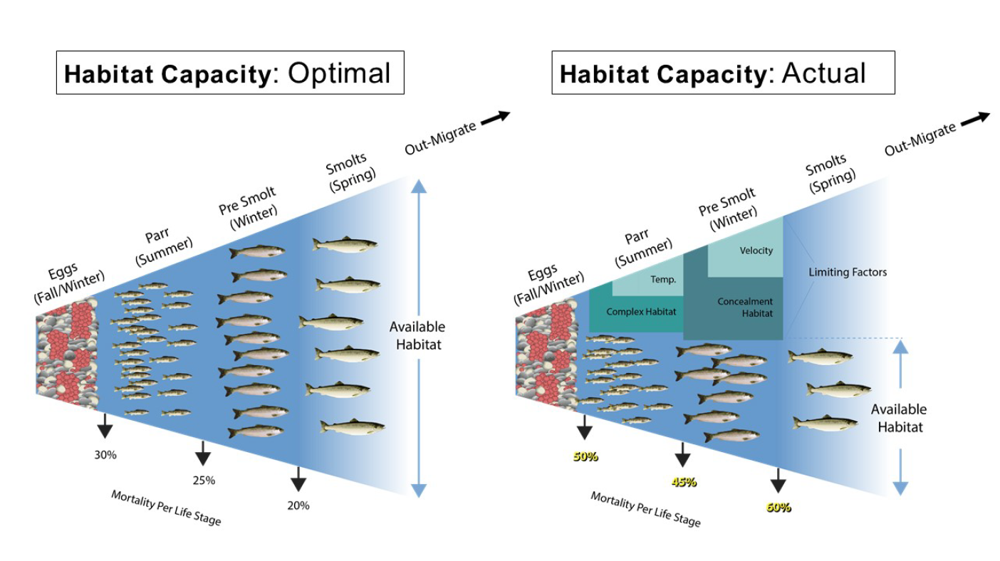

<!-- the following inserts MHE logo into header -->

```{=html}
<script>
   $(document).ready(function() {
     $head = $('#header');
     $head.prepend('')
   });
</script>

<style>
p.caption {
  font-size: 0.8em;
}
</style>
```

```{r setup, echo = FALSE, message = FALSE}
knitr::opts_chunk$set(
  collapse = TRUE,
  warning = FALSE,
  message = FALSE,
  echo = FALSE,
  comment = "#>",
  fig.path = "../figures/",
  dpi = 600
)

options(knitr.kable.NA = '--')

```

```{r load-libraries}
# run this if running chunks directly

# for formatting
library(kableExtra)
library(ggpubr)

# for analysis
library(sf)
library(here)
library(tidyverse)
library(magrittr)
library(ggmap)
library(nngeo)
library(janitor)

theme_set(theme_pubr(x.text.angle = 45,
                     base_size = 8))

```


# Background

Water is the cornerstone of First Foods production and inherently tied to the five fundamental touchstones: hydrology, geomorphology, habitat and network connectivity, riverine biotic community, and riparian vegetation [@Jones2008]. These touchstones form the Umatilla River Vision, a holistic approach to water quality restoration. In support of the Vision, population status and habitat use of riverine fishes defined as First Foods, including Endangered Species Act (ESA) listed middle Columbia River summer-run steelhead, spring-run Chinook salmon, bull trout, and Pacific lamprey, have been identified as critical data needs in the assessment of biotic communities [@Jones2008]. The decline of anadromous Pacific salmonid populations (*Oncorhynchus* spp.) across the Pacific Northwest, USA, has prompted numerous actions aimed at reversing that trend. These actions are often categorized into four 'H's': harvest modification, habitat rehabilitation, hydroelectric operations, and hatchery practices. While these actions can influence salmonid survival, predicting the potential magnitude of population uplift and developing the most cost-effective and sustainable solutions is a complex task that results in substantial uncertainties. Recovery plans, e.g., @NOAA2009, have identified adult escapement targets at the population scale, providing a quantitative metric useful for evaluating the magnitude of survival improvements required. These abundance targets provide a benchmark against which habitat rehabilitation actions can be measured. Here, we apply a novel approach to estimating life stage specific habitat capacity for spring-run Chinook salmon (hereafter Chinook salmon) and summer-run steelhead (hereafter steelhead) to quantify the magnitude and types of tributary habitat restoration needed to achieve recovery goals in the Upper Walla Walla watershed. The necessity of tributary habitat restoration actions can now be demonstrated, and the magnitude of required change can be placed in context with the other 'H's'.

## Focal Species

The focal species for the fish habitat capacity assessment are:

-   Spring-run Chinook salmon (*Oncorhynchus tshawytscha*)
-   Middle Columbia River summer steelhead (*O. mykiss*; ESA-listed "threatened")

While our habitat capacity models specifically address Chinook salmon and steelhead, any uplift in habitat for these species are also expected to uplift:

-   Columbia River bull trout (*Salvelinus confluentus*; ESA-listed "threatened")
-   Pacific lamprey (*Lampetra tridentata*)

## Study Area

This assessment will be focused on the alluvial channel of the Walla Walla River from the confluence with Dry Creek near Lowden, Washington, to the headwaters of the North and South forks of the Walla Walla River (Figure \@ref(fig:uww-map)). The primary study area includes approximately 70 miles of stream. The secondary study area includes the catchment of the primary study area which encompasses approximately 885 square miles. The fish habitat capacity assessment, in particular, is limited to the spatial distribution of Chinook salmon and steelhead in the Upper Walla Walla watershed, as provided by StreamNet (https://www.streamnet.org/home/data-maps/gis-data-sets/).

```{r uww-map, out.width = "100%", fig.cap = "Study area for the Upper Walla Walla watershed fish habitat capacity assessment. Primary rivers and tributaries used by Chinook salmon and steelhead are labeled."}
knitr::include_graphics("../maps/UWW_NorWeST.png")

```


# Habitat Capacity Assessment

```{r load-data}
# Upper Walla Walla QRF extrapolations
load(here("analysis/data/derived_data/uww_qrf_extrapolations.rda"))

# Project area polygons and 200m layer (with habitat attributes) within project area
load(here("analysis/data/derived_data/uww_spatial.rda"))

# convert sf objects to tibbles
uww_sum_df = uww_sum_sf %>%
  st_drop_geometry() %>%
  as_tibble()

uww_win_df = uww_win_sf %>%
  st_drop_geometry() %>%
  as_tibble()

uww_redd_df = uww_redd_sf %>%
  st_drop_geometry() %>%
  as_tibble()

```

## Approach Overview

Habitat capacity deficits (e.g., Figure \@ref(fig:capacity-schematic)) resulting from limitations in habitat quantity and/or quality were assessed for three life stages of Chinook salmon and steelhead: 1) spawning (redds), 2) juvenile summer rearing (parr), and 3) juvenile winter rearing (presmolts). First, the capacity required to meet adult abundance escapement goals was estimated for each of the life stages using a Generalized Capacity Model framework [see Appendix C in @IdahoOSCTeam2019]. Then, the currently available habitat capacity was estimated using a quantile random forest (QRF) approach [@See2021] applied at each life stage. Next, capacity limitations were quantified by subtracting required capacity from available capacity, providing an estimate of (potential) capacity deficit by species and life stage. Finally, results were considered to evaluate target conditions to achieve adult escapement goals, and inform prioritization by identifying species and life stage specific bottlenecks to population productivity in the Upper Walla Walla watershed. Results were also summarized for geomorphic reaches to identify relative low- and high-capacity reaches to assist in prioritization efforts.

```{r capacity-schematic, out.width = "100%", fig.cap = "Schematic depicting an ideal scenario on the left with no limiting factors, while the right depicts a river with significant limiting factors resulting in reduced habitat capacity and production."}


```

## Required Capacity

```{r get-params}
params = read_csv(here("analysis/data/raw_data/LifeHistoryParameters.csv"))

#define target escapement
target.esc = c(3600,3400)
n.sim = 5000

set.seed(352)
#Simulate the required abundances by life stage

#With normal distribution - no stoch for egg:parr, parr:presmolt
reqs = tibble(Sim_number = rep(1:n.sim,2),
              Species = c(rep("Chinook",n.sim),rep("Steelhead",n.sim)),
              Escapement = c(rep(target.esc[1],n.sim), rep(target.esc[2],n.sim)),
              f_ratio = c(rnorm(n.sim, params$Value[1],params$SD[1]),
                          rnorm(n.sim, params$Value[7],params$SD[7])),
              redds_f = c(rnorm(n.sim, params$Value[2],params$SD[2]),
                          rnorm(n.sim, params$Value[8],params$SD[8])),
              fecund = c(rnorm(n.sim, params$Value[3],params$SD[3]),
                          rnorm(n.sim, params$Value[9],params$SD[9])),
              egg_to_parr = c(rep(params$Value[4],n.sim),
                          rep(params$Value[10],n.sim)),
              parr_to_presmolt = c(rep(params$Value[5],n.sim),
                          rep(params$Value[11],n.sim)),
              egg_to_smolt = c(rep(params$Value[6],n.sim),
                               rep(params$Value[12],n.sim))) %>%
  mutate(f_ratio = ifelse(f_ratio < params$Min[1] & Species == "Chinook", params$Min[1],
                          ifelse(f_ratio > params$Max[1] & Species == "Chinook", params$Max[1],
                                 ifelse(f_ratio < params$Min[7] & Species == "Steelhead", params$Min[7],
                                        ifelse(f_ratio > params$Max[7] & Species == "Steelhead", params$Max[7], f_ratio)))),
         redds_f = ifelse(redds_f < params$Min[2] & Species == "Chinook", params$Min[2],
                          ifelse(redds_f > params$Max[2] & Species == "Chinook", params$Max[2],
                                 ifelse(redds_f < params$Min[8] & Species == "Steelhead", params$Min[8],
                                        ifelse(redds_f > params$Max[8] & Species == "Steelhead", params$Max[8], redds_f)))),
         fecund = ifelse(fecund < params$Min[3] & Species == "Chinook", params$Min[3],
                          ifelse(fecund > params$Max[3] & Species == "Chinook", params$Max[3],
                                 ifelse(fecund < params$Min[9] & Species == "Steelhead", params$Min[9],
                                        ifelse(fecund > params$Max[9] & Species == "Steelhead", params$Max[9], fecund)))),
         # egg_to_parr = ifelse(egg_to_parr < params$Min[4] & Species == "Chinook", params$Min[4],
         #                  ifelse(egg_to_parr > params$Max[4] & Species == "Chinook", params$Max[4],
         #                         ifelse(egg_to_parr < params$Min[9] & Species == "Steelhead", params$Min[9],
         #                                ifelse(egg_to_parr > params$Max[9] & Species == "Steelhead", params$Max[9], egg_to_parr)))),
         # parr_to_presmolt = ifelse(parr_to_presmolt < params$Min[5] & Species == "Chinook", params$Min[5],
         #                  ifelse(parr_to_presmolt > params$Max[5] & Species == "Chinook", params$Max[5],
         #                         ifelse(parr_to_presmolt < params$Min[10] & Species == "Steelhead", params$Min[10],
         #                                ifelse(parr_to_presmolt > params$Max[10] & Species == "Steelhead", params$Max[10], parr_to_presmolt))))
         ) %>%
  mutate(Female_escapement = Escapement * f_ratio,
         Redds = Female_escapement * redds_f,
         Eggs = Redds * fecund,
         Summer_juv = Eggs * egg_to_parr,
         Winter_juv = Summer_juv * parr_to_presmolt,
         Smolts = Eggs * egg_to_smolt
           )

#With truncated uniform distribution
# reqs = tibble(Sim_number = rep(1:n.sim,2),
#               Species = c(rep("Chinook",n.sim),rep("Steelhead",n.sim)),
#               Escapement = c(rep(target.esc[1],n.sim), rep(target.esc[2],n.sim)),
#               f_ratio = c(runif(n.sim, params$Value[1]-params$SD[1], params$Value[1]+params$SD[1]),
#                           runif(n.sim, params$Value[6]-params$SD[6], params$Value[6]+params$SD[6])),
#               redds_f = c(runif(n.sim, params$Value[2]-params$SD[2], params$Value[2]+params$SD[2]),
#                           runif(n.sim, params$Value[7]-params$SD[7], params$Value[7]+params$SD[7])),
#               fecund = c(runif(n.sim, params$Value[3]-params$SD[3], params$Value[3]+params$SD[3]),
#                           runif(n.sim, params$Value[8]-params$SD[8],                     params$Value[8]+params$SD[8])),
#               egg_to_parr = c(runif(n.sim, params$Value[4], params$Value[4]),
#                           runif(n.sim, params$Value[9], params$Value[9])),
#               parr_to_presmolt = c(runif(n.sim, params$Value[5], params$Value[5]),
#                           runif(n.sim, params$Value[10], params$Value[10]))) %>%
#   mutate(Female_escapement = Escapement * f_ratio,
#          Redds = Female_escapement * redds_f,
#          Eggs = Redds * fecund,
#          Summer_juv = Eggs * egg_to_parr,
#          Winter_juv = Summer_juv * parr_to_presmolt
#            )

#Summarize sim results
reqs_summary = reqs %>%
  group_by(Species) %>%
  summarize(Mean_Female_esc = mean(Female_escapement),
            Female_escapement_se = sd(Female_escapement),
            Female_escapement_80L = quantile(Female_escapement, .1),
            Female_escapement_80U = quantile(Female_escapement, .9),
            Female_escapement_90L = quantile(Female_escapement, 0.05),
            Female_escapement_90U = quantile(Female_escapement, 0.95),
            Mean_Redds = mean(Redds),
            Redds_se = sd(Redds),
            Redds_80L = quantile(Redds, .1),
            Redds_80U = quantile(Redds, .9),
            Redds_90L = quantile(Redds, 0.05),
            Redds_90U = quantile(Redds, 0.95),
            Mean_Eggs = mean(Eggs),
            Eggs_se = sd(Eggs),
            Eggs_80L = quantile(Eggs, .1),
            Eggs_80U = quantile(Eggs, .9),
            Eggs_90L = quantile(Eggs, 0.05),
            Eggs_90U = quantile(Eggs, 0.95),
            Mean_Summer_juv = mean(Summer_juv),
            Summer_juv_se = sd(Summer_juv),
            Summer_juv_80L = quantile(Summer_juv, .1),
            Summer_juv_80U = quantile(Summer_juv, .9),
            Summer_juv_90L = quantile(Summer_juv, 0.05),
            Summer_juv_90U = quantile(Summer_juv, 0.95),
            Mean_Winter_juv = mean(Winter_juv),
            Winter_juv_se = sd(Winter_juv),
            Winter_juv_80L = quantile(Winter_juv, .1),
            Winter_juv_80U = quantile(Winter_juv, .9),
            Winter_juv_90L = quantile(Winter_juv, 0.05),
            Winter_juv_90U = quantile(Winter_juv, 0.95),
            Mean_Smolts = mean(Smolts),
            Smolts_se = sd(Smolts),
            Smolts_90L = quantile(Smolts, 0.1),
            Smolts_90U = quantile(Smolts, 0.9)
            )

reqs_plotdat = reqs %>%
  left_join(reqs_summary, by = 'Species')


reddsplot = ggplot(reqs_plotdat)+
  geom_density(aes(x=Redds))+
  geom_vline(aes(xintercept=Redds_90L), linetype = 'dotted')+
  geom_vline(aes(xintercept=Redds_90U), linetype = 'dotted')+
  facet_wrap(~Species) +
  theme(axis.ticks.y = element_blank(),
        axis.text.y = element_blank())

summer_juvsplot = ggplot(reqs_plotdat)+
  geom_density(aes(x=Summer_juv))+
  geom_vline(aes(xintercept=Summer_juv_90L), linetype = 'dotted')+
  geom_vline(aes(xintercept=Summer_juv_90U), linetype = 'dotted')+
  facet_wrap(~Species) +
  theme(axis.ticks.y = element_blank(),
        axis.text.y = element_blank())

winter_juvsplot = ggplot(reqs_plotdat)+
  geom_density(aes(x=Winter_juv))+
  geom_vline(aes(xintercept=Winter_juv_90L), linetype = 'dotted')+
  geom_vline(aes(xintercept=Winter_juv_90U), linetype = 'dotted')+
  facet_wrap(~Species) +
  theme(axis.ticks.y = element_blank(),
        axis.text.y = element_blank())

smoltsplot = ggplot(reqs_plotdat)+
  geom_density(aes(x=Smolts))+
  geom_vline(aes(xintercept=Smolts_90L), linetype = 'dotted')+
  geom_vline(aes(xintercept=Smolts_90U), linetype = 'dotted')+
  facet_wrap(~Species) +
  theme(axis.ticks.y = element_blank(),
        axis.text.y = element_blank())

sar_req = target.esc/reqs_summary$Mean_Smolts

rec_goals = tibble(Species = c("Chinook", "Steelhead"),
                   Scenario = "CBPTF 2020",
                   Escapement = target.esc) %>%
  inner_join(params %>%
               mutate(Parameter = recode(Parameter,
                                         "Female Ratio" = "prop_fem",
                                         "Redds/Female" = "redd_per_fem",
                                         "Fecundity" = "fecund",
                                         "Egg:Parr" = "egg_to_parr",
                                         "Parr:Presmolt" = "parr_to_presmolt",
                                         "Egg:Smolt" = "egg_to_smolt")) %>%
               pivot_wider(id_cols = "Species",
                           names_from = "Parameter",
                           values_from = "Value")) %>%
  mutate(`Female Escapement` = reqs_summary$Mean_Female_esc,
         Redds = reqs_summary$Mean_Redds,
         Eggs = reqs_summary$Mean_Eggs,
         `Summer Juveniles` = reqs_summary$Mean_Summer_juv,
         `Winter Juveniles` = reqs_summary$Mean_Winter_juv,
         Smolts = reqs_summary$Mean_Smolts) %>%
  select(-c(prop_fem:egg_to_smolt)) %>%
  pivot_longer(cols = c(Escapement, `Female Escapement`:Smolts),
               names_to = "LifeStage",
               values_to = "Abundance") %>%
  mutate(SE = c(NA,as.numeric(select(reqs_summary, ends_with("se"))[1,]),NA, as.numeric(select(reqs_summary,ends_with("se"))[2,]))) %>%
  mutate(`90% CI, lower` = c(NA,as.numeric(select(reqs_summary, ends_with("90L"))[1,]),NA, as.numeric(select(reqs_summary,ends_with("90L"))[2,]))) %>%
  mutate(`90% CI, upper` = c(NA,as.numeric(select(reqs_summary, ends_with("90U"))[1,]),NA, as.numeric(select(reqs_summary,ends_with("90U"))[2,])))

```

Life stage specific capacity requirements were estimated using a Generalized Capacity Model (GCM) described in Appendix C of @IdahoOSCTeam2019. The model uses a combination of empirical and literature-based parameter estimates (Table \@ref(tab:param-tab)) to determine the capacity required to achieve a given adult abundance goal. We used escapement goals of `r prettyNum(rec_goals$Abundance[rec_goals$Species == "Chinook" & rec_goals$LifeStage == "Escapement"], big.mark = ",")` for Chinook salmon and `r prettyNum(rec_goals$Abundance[rec_goals$Species == "Steelhead" & rec_goals$LifeStage == "Escapement"], big.mark = ",")` for steelhead. These escapement goals are considered high-range goals and are intended to represent *"healthy and harvestable abundance levels that would sustain very high levels of species viability, significant fishery opportunities and harvest, and a fuller range of ecological values"* [@CBPTF2020]. The required capacities to achieve these goals were estimated using the GCM with a simulation approach to account for expected interannual variation in life history parameters. The simulation was conducted by repeatedly drawing applicable parameters from normal distributions with means and standard deviations defined in Table \@ref(tab:param-tab) and constrained within the range of observed values. Standard deviations for egg-to-parr and parr-to-presmolt survival parameters were set to zero due to small sample sizes, high variability, and potential bias leading to potentially unreliable results. Then, adult escapement goals were multiplied step-wise through the applicable parameter values to obtain capacity requirements by life stage. For example, the number of redds necessary for recovery was calculated by multiplying the adult escapement goal by the female ratio and the estimated redds per female. We conducted 5,000 simulations, resulting in a range of capacity requirements that were summarized to provide the mean required capacity by life stage with associated confidence intervals. Sources for each parameter estimate are provided in Table \@ref(tab:param-tab).

```{r param-tab}
params %>%
  select(-Min, -Max) %>%
  kable(booktabs = T,
        digits = 3,
        align = "lcccc",
        format.args = list(big.mark = ",",
                           drop0trailing = T),
        caption = "Life history parameters for the generalized capacity model.") %>%
  kable_styling(full_width = F,
                position = "center",
                bootstrap_options = c("striped", "condensed"))

```

The resulting estimated habitat capacity requirements are shown in Table \@ref(tab:require-tab) and represent the necessary abundance at each life stage to achieve adult escapement goals.

```{r require-tab}
rec_goals %>%
  mutate(`90% CI` = paste0("(",round(`90% CI, lower`,0),"-",round(`90% CI, upper`,0),")")) %>%
  select(-`90% CI, lower`, -`90% CI, upper`) %>%
  kable(booktabs = T,
        digits = 0,
        align = "ccccc",
        format.args = list(big.mark = ",",
                           drop0trailing = T),
        col.names = c("Species", "Scenario","Life-stage","Abundance", "Abundance SE", "90% CI"),
        caption = "Life stage specific habitat capacity requirement estimates necessary to achieve given escapement recovery goals.") %>%
  kable_styling(full_width = F,
                position = "center",
                bootstrap_options = c("striped", "condensed"))

```

## Available Capacity

Available habitat capacity was defined as the maximum abundance the habitat can support for a species and life stage given current habitat quantity and quality. Within fisheries research and management, biotic and abiotic factors have been identified as limiting productivity within, and across, life stages. However, it is assumed that observed fish density is generally a poor indicator of habitat capacity due to both a paucity of individuals (i.e., low spawner abundance), especially in recent decades, and the existence of unmeasured biotic or abiotic variables that may limit capacity. Therefore, available habitat capacity estimates were estimated using a QRF framework developed by See et al. (2021).

### QRF Model

The QRF framework is a novel approach to estimate the carrying capacity of wadable streams to support spawning and rearing Chinook salmon and steelhead. The approach involves fitting a QRF [@Meinshausen2006; @Cade2003] model to paired fish and habitat data across hundreds of sites in several watersheds throughout the Columbia River Basin. Habitat data from the Columbia River Habitat Monitoring Program (CHaMP) were paired to juvenile fish and redd survey data to develop fish-habitat relationships [@See2021]. Importantly, the QRF model places no constraints on possible fish-habitat relationships; instead, relationships are estimated from the empirical data regardless of being positive, negative, linear, non-linear, etc. The QRF approach, with an associated random forest extrapolation model (described below), enables spatially continuous estimates of available habitat capacity given existing conditions at key life stages for Chinook salmon and steelhead. Currently, available QRF models allow evaluation of three anadromous life stages: 1) spawning, 2) juvenile summer rearing, and 3) juvenile winter rearing. Using the observed fish-habitat relationships, we can then predict habitat capacity at any location with habitat data for all model covariates (e.g., at all CHaMP sites) (Table \@ref(tab:cov-tab)). The random forest model produces a distribution of predictions, one for each tree in the forest, and we chose the 90th quantile of that distribution as a proxy for carrying capacity. The QRF models used to estimate available habitat capacity, including data inputs, are described in further detail in Appendix B of @IdahoOSCTeam2019.

```{r cov-tab}
load(here("analysis/data/raw_data/QRF_new_hab_cov_tbl.rda"))

QRF_new_hab_cov_tbl %>%
  select(-Covariate) %>%
  kable(booktabs = T,
        align = "ccccccccl",
        caption = "Habitat covariates and their descriptions used in each of the QRF capacity models. Numbers indicate where each metric ranked in relative importance for each model. Dashes indicate a metric was not used for a given model.") %>%
  kable_styling(position = "center",
                bootstrap_options = c("striped", "condensed"))

```

### Extrapolation Model

Although we have hundreds of sites across the Columbia River basin with detailed habitat data (e.g., CHaMP sites), this only covers a small percentage of the anadromous zone within each watershed. Additionally, many watersheds, including the Walla Walla, do not contain any sites. Therefore, capacity predictions were extrapolated to areas outside of CHaMP sites and watersheds using an accompanying random forest extrapolation model fit to a stream layer available from NOAA Fisheries (https://www.nwfsc.noaa.gov/research/datatech/data/col_basin_hist_project/index.cfm). The dataset consists of a polyline shapefile divided into 200m reaches with various attributes associated with each reach. We refer to these as globally available attributes (GAAs) because they are associated with every reach across all watersheds in the Columbia River Basin derived from the National Hydrography Dataset High Resolution (NHDPlus HR) dataset.

Habitat capacity was estimated for the entirety of the Upper Walla Walla watershed using the accompanying random forest extrapolation model [@See2021]. The extrapolation models were fit using GAAs from the NOAA stream layer dataset as predictor covariates and QRF capacity estimates as the response variable. The random forest framework again allows for non-linear associations between predictor and response variables and constricts capacity predictions within the estimated range from the initial QRF model. Using the random forest extrapolation model, density predictions were calculated for each 200 m NHDPlus HR reach segment within the NFSR watershed, and reach capacities were calculated by multiplying the predicted fish/m by the length of the reach. Predicted habitat capacities from the extrapolation model were then summarized at the watershed scale.

```{r gaa-tbl}
load(here("analysis/data/raw_data/gaa_hab_dict.rda"))

gaa_hab_dict %>% 
  select(Metric = Name,
         Decription = DescriptiveText) %>%
  kable(booktabs = T,
        align = "cl",
        caption = "Globally available attritibutes (GAAs) and their descriptions used in the random forest extrapolation model.") %>%
  kable_styling(full_width = F,
                position = "center",
                bootstrap_options = c("striped", "condensed"))


```

### QRF Capacity Estimates

```{r calc-chnk-capacity}

source(here("R/calc_watershed_cap.R"))

# Chinook salmon, summer parr
chnk_sum_cap = calc_watershed_cap(uww_huc_sf,
                                  uww_sum_sf,
                                  capacity_name = "chnk_per_m",
                                  capacity_se_name = "chnk_per_m_se",
                                  by_stream = T)

# Chinook salmon, winter presmolt
chnk_win_cap = calc_watershed_cap(uww_huc_sf,
                                  uww_win_sf,
                                  capacity_name = "chnk_per_m",
                                  capacity_se_name = "chnk_per_m_se",
                                  by_stream = T)

# Chinook salmon, redds
chnk_redd_cap = calc_watershed_cap(uww_huc_sf,
                                   uww_redd_sf,
                                   capacity_name = "chnk_per_m",
                                   capacity_se_name = "chnk_per_m_se",
                                   by_stream = T)

```

```{r calc-sthd-capacity}
# steelhead, summer parr
sthd_sum_cap = calc_watershed_cap(uww_huc_sf,
                                  uww_sum_sf,
                                  capacity_name = "sthd_per_m",
                                  capacity_se_name = "sthd_per_m_se",
                                  by_stream = T)

# steelhead, winter presmolt
sthd_win_cap = calc_watershed_cap(uww_huc_sf,
                                  uww_win_sf,
                                  capacity_name = "sthd_per_m",
                                  capacity_se_name = "sthd_per_m_se",
                                  by_stream = T)

# steelhead, redds
sthd_redd_cap = calc_watershed_cap(uww_huc_sf,
                                   uww_redd_sf,
                                   capacity_name = "sthd_per_m",
                                   capacity_se_name = "sthd_per_m_se",
                                   by_stream = T)

```

```{r compile-capacity}
cap_totals = list(chnk_sum = chnk_sum_cap,
                  chnk_win = chnk_win_cap,
                  chnk_redd = chnk_redd_cap,
                  sthd_sum = sthd_sum_cap,
                  sthd_win = sthd_win_cap,
                  sthd_redd = sthd_redd_cap) %>%
  map_df(.id = "type",
        .f = function(x) {
          x %>%
            filter(StreamName == "Total")
        }) %>%
  mutate(Species = str_split(type, "_", simplify = T)[ ,1],
         LifeStage = str_split(type, "_", simplify = T)[ ,2],
         tot_cap_90CI_L = tot_cap - tot_cap_se*1.65,
         tot_cap_90CI_U = tot_cap + tot_cap_se*1.65) %>%
  mutate(Species = recode(Species,
                          "chnk" = "Chinook",
                          "sthd" = "Steelhead"),
         LifeStage = recode(LifeStage,
                            "sum" = "Summer Juveniles",
                            "win" = "Winter Juveniles",
                            "redd" = "Redds")) %>%
  select(Species,
         LifeStage,
         everything(),
         -StreamName,
         -type)


#Estimating available capacity in terms of spawners
availcap_spawners = tibble(Species = c(rep("Chinook",3), rep("Steelhead",3)),
                            LifeStage = rep(c("Summer Juveniles","Winter Juveniles","Redds"),2),
                            LifeStage_Cap = cap_totals$tot_cap,
                           Pred_Spawners = NA)
#chnk
availcap_spawners$Pred_Spawners[1] = availcap_spawners$LifeStage_Cap[1]/(params$Value[1]*params$Value[2]*params$Value[3]*params$Value[4])
                                                                         
availcap_spawners$Pred_Spawners[2] = availcap_spawners$LifeStage_Cap[2]/(params$Value[1]*params$Value[2]*params$Value[3]*params$Value[4]*params$Value[5])

availcap_spawners$Pred_Spawners[3] = availcap_spawners$LifeStage_Cap[3]/(params$Value[1]*params$Value[2])

#sthd
availcap_spawners$Pred_Spawners[4] = availcap_spawners$LifeStage_Cap[4]/(params$Value[7]*params$Value[8]*params$Value[9]*params$Value[10])
                                                                         
availcap_spawners$Pred_Spawners[5] = availcap_spawners$LifeStage_Cap[5]/(params$Value[7]*params$Value[8]*params$Value[9]*params$Value[10]*params$Value[11])

availcap_spawners$Pred_Spawners[6] = availcap_spawners$LifeStage_Cap[6]/(params$Value[7]*params$Value[8])

```

Estimates of total habitat capacity for the Upper Walla Walla watershed by species and life stage are provided in Table \@ref(tab:cap-table). Estimates were made using the anadromous spatial domain defined by StreamNet for Chinook salmon and steelhead, and confirmed based on local, expert knowledge. Available habitat capacity was extrapolated within these spatial extents for `r unique(cap_totals$n_rchs[cap_totals$Species == "Chinook"])` reaches totaling `r round(unique(cap_totals$tot_length[cap_totals$Species == "Chinook"]) / 1000)` km in length for Chinook salmon and `r prettyNum(unique(cap_totals$n_rchs[cap_totals$Species == "Steelhead"]), big.mark = ",")` reaches totaling `r round(unique(cap_totals$tot_length[cap_totals$Species == "Steelhead"]) / 1000)` km in length for steelhead. Each reach is equal to or approximately 200 m in length. Different spatial domains could be used for both Chinook salmon and steelhead if deemed appropriate. Capacity estimates for geomorphic reaches and life stage are summarized in a following section.

```{r cap-table}
cap_totals %>%
  mutate(avg_cap_per_m = tot_cap / tot_length) %>%
  mutate(tot_length_km = tot_length / 1000,
         `90% CI` = paste0("(", round(tot_cap_90CI_L, 0), "-", round(tot_cap_90CI_U, 0),")")) %>%
  rename(`n Reaches` = n_rchs,
         `Stream Length (km)` = tot_length_km,
         Capacity = tot_cap,
         SE = tot_cap_se,
         `Avg. Capacity / m` = avg_cap_per_m) %>%
  select(Species,
         LifeStage,
         `n Reaches`,
         `Stream Length (km)`,
         Capacity,
         SE,
         `90% CI`,
         `Avg. Capacity / m`) %>%
  kable(booktabs = T,
        digits = c(0, 0, 1, 0, 0, 0, 0, 3),
        align = "cccccccc",
        format.args = list(big.mark = ","),
        col.names = c("Species","Life-stage","Reaches","Stream Length (km)", "Capacity","SE", "Capacity 90% CI","Avg. Capacity/m"),
        caption = "Estimates of current available habitat capacity, by species and life stage, in the Upper Walla Walla watershed within the spatial domains defined by StreamNet.") %>%
  kable_styling(full_width = F,
                position = "center",
                bootstrap_options = c("striped", "condensed"))

```

Maps depicting capacity extrapolations are useful to visualize relative low- versus high-capacity areas. The spatial results used to generate these maps have been exported and are available for download at https://github.com/Mount-Hood-Environmental/UWW.plan. Chinook salmon and steelhead capacity extrapolations for the watershed are shown in Figures \@ref(fig:chnk-maps) and \@ref(fig:sthd-maps), respectively.

```{r create-chnk-maps}
# pick a background river color
river_color = "lightskyblue1"

# chinook summer parr
chnk_sum_map = uww_sum_sf %>%
  ggplot() +
  geom_sf(data = uww_huc_sf %>%
            st_union() %>%
            nngeo::st_remove_holes(),
          fill = NA,
          color = "gray50") +
  geom_sf(color = river_color) +
  geom_sf(data = uww_sum_sf %>%
            filter(chnk),
          aes(color = chnk_per_m2),
          size = 1) +
  scale_color_viridis_c(direction = -1) +
  #theme_bw() +
  theme(legend.position = "bottom",
        axis.text.x = element_blank(),
        axis.text.y = element_blank(),
        axis.ticks = element_blank()) +
  labs(title = "Chinook, Summer Juveniles",
       color = expression(`Summer Juv` / m^2))

# chinook winter presmolts
chnk_win_map = uww_win_sf %>%
  ggplot() +
  geom_sf(data = uww_huc_sf %>%
            st_union() %>%
            nngeo::st_remove_holes(),
          fill = NA,
          color = "gray50") +
  geom_sf(color = river_color) +
  geom_sf(data = uww_win_sf %>%
            filter(chnk),
          aes(color = chnk_per_m2),
          size = 1) +
  scale_color_viridis_c(direction = -1) +
  #theme_bw() +
  theme(legend.position = "bottom",
        axis.text.x = element_blank(),
        axis.text.y = element_blank(),
        axis.ticks = element_blank()) +
  labs(title = "Chinook, Winter Juveniles",
       color = expression(`Winter Juv` / m^2))

# chinook redds
chnk_redd_map = uww_redd_sf %>%
  ggplot() +
  geom_sf(data = uww_huc_sf %>%
            st_union() %>%
            nngeo::st_remove_holes(),
          fill = NA,
          color = "gray50") +
  geom_sf(color = river_color) +
  geom_sf(data = uww_redd_sf %>%
            filter(chnk) %>%
            mutate(chnk_per_km = chnk_per_m * 1000),
          aes(color = chnk_per_km),
          size = 1) +
  scale_color_viridis_c(direction = -1) +
  #theme_bw() +
  theme(legend.position = "bottom",
        axis.text.x = element_blank(),
        axis.text.y = element_blank(),
        axis.ticks = element_blank()) +
  labs(title = "Chinook, Redds",
       color = expression(Redds / km))
    

```

```{r create-sthd-maps}
# steelhead summer juveniles
sthd_sum_map = uww_sum_sf %>%
  ggplot() +
  geom_sf(data = uww_huc_sf %>%
            st_union() %>%
            nngeo::st_remove_holes(),
          fill = NA,
          color = "gray50") +
  geom_sf(color = river_color) +
  geom_sf(data = uww_sum_sf %>%
            filter(sthd),
          aes(color = sthd_per_m2),
          size = 1) +
  scale_color_viridis_c(direction = -1) +
  #theme_bw() +
  theme(legend.position = "bottom",
        axis.text.x = element_blank(),
        axis.text.y = element_blank(),
        axis.ticks = element_blank()) +
  labs(title = "Steelhead, Summer Juveniles",
       color = expression(`Summer Juv` / m^2))

# steelhead winter juveniles
sthd_win_map = uww_win_sf %>%
  ggplot() +
  geom_sf(data = uww_huc_sf %>%
            st_union() %>%
            nngeo::st_remove_holes(),
          fill = NA,
          color = "gray50") +
  geom_sf(color = river_color) +
  geom_sf(data = uww_win_sf %>%
            filter(sthd),
          aes(color = sthd_per_m2),
          size = 1) +
  scale_color_viridis_c(direction = -1) +
  #theme_bw() +
  theme(legend.position = "bottom",
        axis.text.x = element_blank(),
        axis.text.y = element_blank(),
        axis.ticks = element_blank()) +
  labs(title = "Steelhead, Winter Juveniles",
       color = expression(`Winter Juv` / m^2))

# steelhead redds
sthd_redd_map = uww_redd_sf %>%
  ggplot() +
  geom_sf(data = uww_huc_sf %>%
            st_union() %>%
            nngeo::st_remove_holes(),
          fill = NA,
          color = "gray50") +
  geom_sf(color = river_color) +
  geom_sf(data = uww_redd_sf %>%
            filter(sthd) %>%
            mutate(sthd_per_km = sthd_per_m * 1000),
          aes(color = sthd_per_km),
          size = 1) +
  scale_color_viridis_c(direction = -1) +
  #theme_bw() +
  theme(legend.position = "bottom",
        axis.text.x = element_blank(),
        axis.text.y = element_blank(),
        axis.ticks = element_blank()) +
  labs(title = "Steelhead, Redds",
       color = expression(Redds / km))

```

```{r chnk-maps, fig.cap = "Extrapolations of habitat capacity for Chinook salmon, by life-stage, within the Upper Walla Walla watershed."}
ggarrange(chnk_sum_map,
          chnk_win_map,
          chnk_redd_map)

```

```{r sthd-maps, fig.cap = "Extrapolations of habitat capacity for steelhead, by life-stage, within the Upper Walla Walla watershed."}
ggarrange(sthd_sum_map,
          sthd_win_map,
          sthd_redd_map)

```

## Capacity Limitations

Finally, potential habitat capacity limitations were quantified by subtracting required capacity from available capacity (Table \@ref(tab:cap-limits)). When required capacity exceeded available capacity, this represented a habitat capacity deficit for a given species and life stage within the Upper Walla Walla watershed. Contrary, a "negative deficit" is indicative of a surplus of available habitat capacity necessary to meet adult escapement goals. Deficits can be used to identify potential species and life stage bottlenecks in physical habitat quantity and/or quality. Relative habitat capacity deficits were also calculated as available capacity divided by required capacity. Comparisons of available and required capacity by species and life stages are also depicted in Figures \@ref(fig:chnk-def-fig) and \@ref(fig:sthd-def-fig)). This information can be useful in determining the types of actions that might provide the most benefit to address triburary habitat bottlenecks. For example, a spawning (redd) capacity deficit might suggest that actions to increase available spawning gravels, increase cover (for holding), moderate stream temperatures, and increase the frequency of pool tailouts and pool-riffle interfaces could provide the most benefit to alleviate habitat bottlenecks, especially in strategic locations.

```{r cap-limits}
rec_goals %>%
  left_join(cap_totals %>%
              select(-n_rchs,
                     -tot_length)) %>%
  filter(LifeStage != "Smolts") %>%
  mutate(Deficit = Abundance - tot_cap,
         `Relative Deficit` = Deficit / tot_cap) %>%
  rename(`Required Capacity` = Abundance,
         `Available Capacity` = tot_cap,
         `Capacity SE` = tot_cap_se) %>%
  select(-tot_cap_90CI_U, -tot_cap_90CI_L, -`90% CI, lower`, -`90% CI, upper`) %>%
  kable(booktabs = T,
        digits = c(0,0,0,0,0,0,0,0,2),
        align = "cccccccccccc",
        format.args = list(big.mark = ","),
        col.names = c("Species","Scenario","Life-stage","Required Capacity", "Required Capacity SE","Available Capacity","Available Capacity SE","Deficit","Relative Deficit"),
        caption = "Capacity deficits and relative deficits based on recovery goals.") %>%
  kable_styling(full_width = F,
                position = "center",
                bootstrap_options = c("striped", "condensed"))

```

```{r chnk-def-fig, fig.cap = "Estimated available capacity given current habitat conditions for Chinook salmon at three life stages in the Upper Walla Walla watershed. Available capacity was calculated using a quantile random forest approach, and required capacity was calculated using a generalized capacity model with adult escapement goals. Error bars represent 90% confidence intervals."}
chnk_def_p = rec_goals %>%
  select(-Scenario) %>%
  filter(Species == "Chinook",
         LifeStage %in% c("Redds",
                          "Summer Juveniles",
                          "Winter Juveniles")) %>%
  left_join(cap_totals %>%
              select(-n_rchs,
                     -tot_length)) %>%
  select(!Species) %>%
  rename(Required = Abundance,
         Available = tot_cap,
         se = tot_cap_se) %>%
  pivot_longer(cols = c("Required",
                        "Available")) %>%
  mutate(std.error = ifelse(name == "Required", SE, se),
         cap_90CI_L = ifelse(name == "Required", `90% CI, lower`, tot_cap_90CI_L),
         cap_90CI_U = ifelse(name == "Required", `90% CI, upper`, tot_cap_90CI_U)) %>%
  select(LifeStage, name, value, std.error, cap_90CI_L, cap_90CI_U) %>%
  ggplot() +
  geom_bar(aes(x = name,
               y = value,
               fill = name),
           color = "black",
           stat = "identity") +
  scale_x_discrete(limits = rev) +
  scale_fill_manual(name = "Capacity",
                    values = c("gray30", "forestgreen")) +
  coord_flip() +
  facet_wrap(~ LifeStage,
             scales = "free",
             ncol = 1,
             strip.position = "left",
             labeller = labeller(LifeStage = label_wrap_gen(width = 10))) +
  geom_errorbar(aes(x = name,
                    ymin = cap_90CI_L,
                    ymax = cap_90CI_U),
                width = 0.3,
                size = 0.5) +
  scale_y_continuous(labels = scales::comma,
                     expand = c(0,0)) +
  labs(title = "Chinook salmon") +
  theme(axis.title.x = element_blank(),
        axis.title.y = element_blank(),
        axis.text.y = element_blank(),
        axis.ticks.y = element_blank(),
        axis.text.x = element_text(size = 8,
                                   color = "black"),
        legend.title = element_text(size = 10),
        legend.text = element_text(size = 10),
        strip.text.y = element_text(size = 10),
        plot.title = element_text(size = 12,
                                  face = "bold"),
        legend.position = "right")

chnk_def_p

```

```{r chnk-dens-req-fig, fig.cap = "Comparison of model predictions for available and required habitat capacities"}
 chnk_def_line = rec_goals %>%
  select(-Scenario) %>%
  filter(Species == "Chinook",
         LifeStage %in% c("Redds",
                          "Summer Juveniles",
                          "Winter Juveniles")) %>%
  left_join(cap_totals %>%
              select(-n_rchs,
                     -tot_length)) %>%
  select(!Species) %>%
  rename(Required = Abundance,
         Available = tot_cap,
         se = tot_cap_se) %>%
  pivot_longer(cols = c("Required",
                        "Available")) %>%
  mutate(std.error = ifelse(name == "Required", SE, se),
         cap_90CI_L = ifelse(name == "Required", `90% CI, lower`, tot_cap_90CI_L),
         cap_90CI_U = ifelse(name == "Required", `90% CI, upper`, tot_cap_90CI_U)) %>%
  select(LifeStage, name, value, std.error, cap_90CI_L, cap_90CI_U) %>%
  ggplot() +
  geom_point(aes(x = name,
               y = value),
           color = "black",
           stat = "identity") +
  scale_x_discrete(limits = rev) +
  scale_fill_manual(name = "Capacity",
                    values = c("gray30", "forestgreen")) +
  coord_flip() +
  facet_wrap(~ LifeStage,
             scales = "free",
             ncol = 1,
             strip.position = "left",
             labeller = labeller(LifeStage = label_wrap_gen(width = 10))) +
  geom_errorbar(aes(x = name,
                    ymin = cap_90CI_L,
                    ymax = cap_90CI_U),
                width = 0,
                size = 0.2) +
  scale_y_continuous(labels = scales::comma,
                     expand = c(0,0)) +
  labs(title = "Chinook salmon") +
  theme(axis.title.x = element_blank(),
        axis.title.y = element_blank(),
        #axis.text.y = element_blank(),
        #axis.ticks.y = element_blank(),
        axis.text.x = element_text(size = 8,
                                   color = "black"),
        legend.title = element_text(size = 10),
        legend.text = element_text(size = 10),
        strip.text.y = element_text(size = 10),
        plot.title = element_text(size = 12,
                                  face = "bold"),
        legend.position = "right")

```

```{r sthd-def-fig, fig.cap = "Estimated available capacity given current habitat conditions for steelhead at three life stages in the Upper Walla Walla watershed. Available capacity was calculated using a quantile random forest approach, and required capacity was calculated using a generalized capacity model with adult escapement goals. Error bars represent 90% confidence intervals."}
sthd_def_p = rec_goals %>%
  select(-Scenario) %>%
  filter(Species == "Steelhead",
         LifeStage %in% c("Redds",
                          "Summer Juveniles",
                          "Winter Juveniles")) %>%
  left_join(cap_totals %>%
              select(-n_rchs,
                     -tot_length)) %>%
  select(!Species) %>%
  rename(Required = Abundance,
         Available = tot_cap,
         se = tot_cap_se) %>%
  pivot_longer(cols = c("Required",
                        "Available")) %>%
  mutate(std.error = ifelse(name == "Required", SE, se),
         cap_90CI_L = ifelse(name == "Required", `90% CI, lower`, tot_cap_90CI_L),
         cap_90CI_U = ifelse(name == "Required", `90% CI, upper`, tot_cap_90CI_U)) %>%
  select(LifeStage, name, value, std.error, cap_90CI_L, cap_90CI_U) %>%
  ggplot() +
  geom_bar(aes(x = name,
               y = value,
               fill = name),
           color = "black",
           stat = "identity") +
  scale_x_discrete(limits = rev) +
  scale_fill_manual(name = "Capacity",
                    values = c("gray30", "dodgerblue3")) +
  coord_flip() +
  facet_wrap(~ LifeStage,
             scales = "free",
             ncol = 1,
             strip.position = "left",
             labeller = labeller(LifeStage = label_wrap_gen(width = 10))) +
  geom_errorbar(aes(x = name,
                    ymin = cap_90CI_L,
                    ymax = cap_90CI_U),
                width = 0.3,
                size = 0.5) +
  scale_y_continuous(labels = scales::comma,
                     expand = c(0,0)) +
  labs(title = "Steelhead") +
  theme(axis.title.x = element_blank(),
        axis.title.y = element_blank(),
        axis.text.y = element_blank(),
        axis.ticks.y = element_blank(),
        axis.text.x = element_text(size = 8,
                                   color = "black"),
        legend.title = element_text(size = 10),
        legend.text = element_text(size = 10),
        strip.text.y = element_text(size = 10),
        plot.title = element_text(size = 12,
                                  face = "bold"),
        legend.position = "right")

sthd_def_p

```

As an alternative and complementary approach, available capacity deficits can also be evaluated in terms of spawning escapement abundance using the GCM approach (Table \@ref(tab:cap-spawnconv-tbl)). In other words, the predicted available habitat capacity for a given life stage can be converted into an esimate of the number of spawners that life stage can support using life stage transition parameters (Table \@ref(tab:param-tab)). For example, predicted redd capacity is divided by the estimated number of redds per female and the female ratio to provide an estimate of the spawner abundance that can be "supported" by the spawning (redd) capacity.

```{r cap-spawnconv-tbl}
availcap_spawners %>%
  #rename(`Life Stage` = LifeStage,
  #       `Available Capacity` = LifeStage_Cap,
  #       `Predicted Spawners` = Pred_Spawners) %>%
  kable(booktabs = T,
        digits = c(0,0,0,0),
        align = "cccc",
        format.args = list(big.mark = ","),
        col.names = c("Species","Life stage","Available Capacity","Predicted Spawners"),
        caption = "Estimated capacity by life-stage and the predicted abundance of spawners supported.") %>%
  kable_styling(full_width = F,
                position = "center",
                bootstrap_options = c("striped", "condensed"))

```


# Discussion

## Limited Species and Life-Stages

Results from the watershed-scale habitat capacity assessment identified that sufficient juvenile rearing habitat, during summer and winter months, is likely available for Chinook salmon to support an escapement of 3,600 adults (Table \@ref(tab:cap-limits); Figure \@ref(fig:chnk-def-fig)). However, there does not appear to be sufficient spawning (redd) habitat available in the Upper Walla Walla watershed. Using the GCM approach, it is estimated that habitat in the Upper Walla Walla watershed would need to support an estimated 1,242 redds (90% CI: 758 - 1,904) to support 3,600 adults; a 317% increase from the estimated available capacity of 298 redds (90% CI: 289 - 307). The available capacity estimate of 298 redds would also suggest that the current spawning habitat could support 894 adult spawners, assuming life stage transition parameters in Table \@ref(tab:param-tab).

For steelhead, there appears to be sufficient juvenile rearing habitat, during winter months, to support an escapement of 3,400 adults (Table \@ref(tab:cap-limits); Figure \@ref(fig:sthd-def-fig)). However, there does not appear to be sufficient spawning (redd) habitat available. Using the GCM approach, it is estimated that habitat in the watershed would need to support an estimated 2,017 redds (90% CI: 920 - 3,092) to support 3,400 adults; an 87% increase from the estimated available capacity of 1,079 redds (90% CI: 1,054 - 1,104). Similar, it is estimated that 1,355,743 juveniles (90% CI: 624,165 - 2,088,097), during summer months, would be required to support adult escapement goals; a 33% increase from the estimated available capacity of 1,016,587 juveniles (90% CI: 999,016 - 1,034,157). The available capacity estimates of 1,079 redds and 1,016,587 summer juveniles alteratively suggest that the current spawning and summer rearing habitat could support 1,827 and 2,608 adult spawners, respectively, assuming life stage transition parameters in Table \@ref(tab:param-tab).

## Target Conditions to Address Limitations

Conservation and rehabilitation actions taken in the Upper Walla Walla watershed should aim to increase the quantity and/or quality of available habitat for Chinook salmon and steelhead. The focus should be on improving spawning habitat, for both species, as well as juvenile summer rearing habitat, at least for steelhead. The assessment of habitat capacity suggests that the NFSR would need to support an additional 944 Chinook salmon redds, 938 steelhead redds, as well as 339,156 juvenile steelhead during summer months to provide sufficient tributary habitat to achieve recovery objectives of 3,600 and 3,400 adult spawners for Chinook salmon and steelhead, respectively. These values represent about 317%, 87%, and 33% increases, respectively, relative to existing carrying capacity to alleviate watershed habitat bottlenecks.There are two primary strategies to address the identified habitat capacity deficits: 1) implement rehabilitation actions within lower-quality habitats to increase available capacity (i.e., increase quality by restoring ecological and river processes), or 2) increase the available stream network in tributaries and headwater habitats by addressing issues with habitat connectivity (i.e., increase quantity by improving or removing barriers). More than likely, a combination of both strategies will be necessary to address identified capacity deficits and improve quantity and quality to remove tributary habitat limitations. 

Increasing Chinook salmon and steelhead abundance to meet recovery objectives will likely require a combination of "active" and "passive" actions. Primary objectives for rehabilitation actions may be focused on improving and increasing habitat for a particular species and life stage; however it is important that cumulative actions address fish and ecosystem process in a holistic manner. This means considering connectivity, complexity, and overall functionality that supports a variety of species and life stages. For instance, improving spawning habitat for Chinook salmon and steelhead in only the lowest reaches of the watershed while improving juvenile steelhead rearing only in tributaries and headwaters is likely not an effective approach to achieve population objectives. For population-level benefits, projects may focus on a specific deficit (e.g., Chinook salmon spawning), but should accommodate multiple species and life stages while complementing nearby projects or existing high-quality habitat. As an example, implementing beaver dam analogs (BDAs) or similar features in tributaries and headwater areas may be an effective means to increase juvenile rearing capacity while also benefitting spawning. BDAs have been shown to increase juvenile steelhead density, survival, and production [@Bouwes2016] as well as buffer against stream temperature extremes [@Weber2017]. The also mimic and promote natural beaver dams which have been shown to attenuate late season water declines [@Burchsted2010; @Westbrook2006]. Designing and planning rehabilitation projects that employ both watershed- and reach-scale strategies to meet recovery objectives will ultimately provide more robust benefits to the fish population(s) and the ecosystem.

<!--Additionally, having high-quality rearing habitat downstream of high-quality spawning habitat would allow juvenile fish emerging from natal areas redds the opportunity to “trickle down” into high-quality rearing habitat, rather than swim upstream in search of more suitable rearing habitat, minimizing the energy expended during early life history.--> 

Deficiencies in fish-habitat data specific to fry and early parr life stages, plus a general lack of habitat suitability and preference indices for fry, precluded analysis of potential limitations for these early life stages. However, it is generally recognized that fry and early parr require slow velocity habitats (e.g., off-channel areas, beaver complexes, floodplains, small side-channels) and instream cover for growth and predator avoidance. Due to changes in land use practices within the Upper Walla Walla floodpain, it is likely that floodplain connectivity (a critical component for fry and early parr rearing and growth) has been greatly altered. When possible, incorporating strategies to increase the frequency and duration of floodplain inundation and connectivity into designs would providefry and early parr access to valuable habitats where they can hold and feed in near-lentic conditions. In addition, other life stages (e.g., adult holding, egg incubation) should not be dismissed. For example, fine sedimentation can fill interstitial spaces and reduce rates of egg incubation. Actions to reduce fine sedimentation and/or provide fry and early parr stream velocity refugia and cover should be considered as part of a holistic plan.

Actions targeted at increasing spawning habitat capacity should aim to increase stream complexity (including channel unit frequency and hydraulic diversity), cover, and provide ample riffle-pool interfaces including pool tailouts with substrates consisting of fine and coarse gravels, where possible. The combination of these characteristics provides slow-water refuge with cover for holding adults, as well as ideal conditions for egg incubation (i.e., sufficient flow and interstitial spaces for protection and oxygenation of eggs). Pool tailouts and pool-riffle interfaces additionally provide sufficient sediment sorting during redd excavation [@Moir2010] and encourage hyporheic flow which aids in oxygenation of eggs [@Harrison2019]. Depth average velocities of around 0.25 m/s to 1.25 m/s are generally suitable for Chinook salmon and steelhead spawning [@Maret2006].

During summer, juvenile Chinook salmon and steelhead aim to maximize growth while minimizing exposure to predators. As such, actions targeted at improving summer rearing habitat should strive to create deeper pools and runs (i.e. increases average thalweg and pool depths), increase channel unit frequency while balancing the proportion of riffles and rapids, provide ample cover (large wood and total fish cover), and include a variety of substrate sizes geomorphically appropriate for runs and pools. Combined, these characteristics present juvenile fish the opportunity to occupy a variety of microhabitats to optimize bioenergetic inputs and expenses. These characteristics provide options where juvenile fish can rest and hold in slow-velocity water (i.e., pools, behind structure or boulders, within cover, adjacent to seams, etc.) adjacent to higher velocity water that present increased forage opportunities, while cover and instream structure provides protection from predators. The combination of microhabitats provides options where the amount of energy necessary to maintain instream position is minimized, the amount of forage available is maximized (or at least increased), and cover provides refuge from predators at minimal energetic cost. Last, incorporating side channels, off-channels, and/or island complexes can be an effective tool to increase the frequency and scale of target characteristics, ultimately allowing for more microhabitat options for fish, particularly during juvenile rearing.

Finally, it should be noted that NorWeST climate projections predict that large portions of the Upper Walla Walla watershed are or may become thermally sub-optimal for Chinook salmon spawning and summer parr rearing (both species). Rehabilitation actions should consider strategies to buffer stream temperatures (e.g., increasing shading, cover, hyporheic flow, etc.) from future potential climate impacts.

## Further Considerations

Estimates of the required number of redds, eggs, or fish, by life stage, to support adult escapement recovery goals are inherently tied to life stage transition parameters and any interpretations of those values should consider the following:

* Some parameter estimates provided in Table \@ref(tab:param-tab), including Chinook salmon redds per female and parr-to-presmolt survival and steelhead fecundity, were used in @IdahoOSCTeam2019 and derived from data for the Upper Salmon subbasin, Idaho. However, when possible, we attempted to use more regional datasets to derive parameter values including from the Grande Ronde, Middle Fork John Day, Tucannon, and Umatilla watersheds. Additionally, some parameters, particularly egg-to-parr and parr-to-presmolt survival, were often generated with datasets with short time-series and are the result of model predictions given assumptions about other life history parameters such as redds epr female and fecudity. We found that these survival parameters may be unreliable due to these potential issues, and as a result, did not include measures of uncertainty for these parameters. Possible solutions for this issue includie additional literature research and data compilation to obtain more reliable parameters or using widely available data for survival to smoltification to estimate absolute lower bounds for required habitat capacity. However, our attempt was to use more local datasets with similar habitat conditions, climate, and life histories as Chinook salmon and steelhead in the Upper Walla Walla watershed and we feel that the GCM model provides an appropriate approximation of the number of redds, eggs, or fish by life stage that may be necessary to accomplish stated adult escapement goals. 

* To support the assessment, we used the GCM to predict the number of smolts required at spawner escapement goals. For the predicted smolt abundances to result in adult escapement targets being met in successive generations, we recognize that smolt-to-adult return rates (SARs) would have to average `r round(sar_req[1],3)*100`% for Chinook salmon and `r round(sar_req[2],3)*100` for steelhead before accounting for potential iteroparity.

Similar, currently available habitat capacity estimates from the QRF and associated random forest extrapolation model are sensitive to some assumptions and the following should be considered during interpretation:

* The extrapolation model is constrained to make capacity predictions within the spatial distribution of Chinook salmon and steelhead defined by StreamNet (https://www.streamnet.org/home/data-maps/gis-data-sets/). In some cases, reaches or tributaries above partial or full barriers (e.g., thermal barriers, culverts) can be included within the StreamNet domain. Conversely, sometimes upstream reaches that could be occupied by anadromous fish are not included in the StreamNet domain if the species has not been observed in that reach in recent decades. Nonetheless, if better information is available to define a spatial distribution in the Upper Walla Walla watershed. Increasing or decreasing the modeled spatial domain would inherently result in increased or decreased available capacity estimates, respectively.

* All available habitat capacity estimates in the Upper Walla Walla watershed were made using the random forest extrapolation model, an extension of the QRF model(s) necessary when direct measurements of the habitat covariates (\@ref(tab:cov-tab)) are not available. Capacities predicted using the extrapolation can be refined with habitat data collection using either the CHaMP or Drone Assisted Stream Habitat (DASH; @Carmichael2019) protocols, a streamlined version of DASH that can be used to collect the covariates necessary for QRF models. Data collected using the DASH protocol is designed to directly integrate with the QRF capacity models [@See2021] and would reduce the reliance of capacity predictions on GAAs, resulting in predictions that directly relate to habitat measurements and are informative for restoration design and monitoring. If direct estimates of available habitat capacity are desired in the Upper Walla Walla watershed for project design or monitoring in the future, the CHaMP and/or DASH protocols are recommended to measure habitat characteristics. Alternatively, the availability and resolution of GAA parameters may increase over time and those could be added to the spatially continuous, linear network; however, joining those attributes to the existing spatial dataset would be time and cost intensive.


# Literature Cited

<!-- The following line ensures the references appear here for the MS Word or HTML output files, rather than right at the end of the document (this will not work for PDF files):  -->

::: {#refs}
:::


# Habitat Capacity by Geomorphic Reach

```{r chnk-geo-reaches}
uww_sum_sf_rch = uww_sum_sf %>%
  rename(GNIS_Name_orig = GNIS_Name,
         GNIS_Name = Geo_Reach)

# Chinook salmon, summer parr
chnk_sum_cap_rch = calc_watershed_cap(uww_huc_sf,
                                  uww_sum_sf_rch %>%
                                    filter(!is.na(GNIS_Name)),
                                  capacity_name = "chnk_per_m",
                                  capacity_se_name = "chnk_per_m_se",
                                  by_stream = T) %>%
  rename(Geo_Reach = StreamName) %>%
  mutate(tot_length = tot_length / 1000,
         'Avg. Capacity/km' = tot_cap/tot_length,
         'Geo_Reach' = replace_na(`Geo_Reach`, 'Total'))

# Chinook salmon, winter presmolt
uww_win_sf_rch = uww_win_sf %>%
  rename(GNIS_Name_orig = GNIS_Name,
         GNIS_Name = Geo_Reach)

chnk_win_cap_rch = calc_watershed_cap(uww_huc_sf,
                                  uww_win_sf_rch %>%
                                    filter(!is.na(GNIS_Name)),
                                  capacity_name = "chnk_per_m",
                                  capacity_se_name = "chnk_per_m_se",
                                  by_stream = T) %>%
  rename(Geo_Reach = StreamName) %>%
  mutate(tot_length = tot_length / 1000,
         'Avg. Capacity/km' = tot_cap/tot_length,
         'Geo_Reach' = replace_na(`Geo_Reach`, 'Total'))

# Chinook salmon, redds
uww_redd_sf_rch = uww_redd_sf %>%
  rename(GNIS_Name_orig = GNIS_Name,
         GNIS_Name = Geo_Reach)

chnk_redd_cap_rch = calc_watershed_cap(uww_huc_sf,
                                  uww_redd_sf_rch %>%
                                    filter(!is.na(GNIS_Name)),
                                  capacity_name = "chnk_per_m",
                                  capacity_se_name = "chnk_per_m_se",
                                  by_stream = T) %>%
  rename(Geo_Reach = StreamName) %>%
  mutate(tot_length = tot_length / 1000,
         'Avg. Capacity/km' = tot_cap/tot_length,
         'Geo_Reach' = replace_na(`Geo_Reach`, 'Total'))

#### Append the avg cap/km back to geo rch .shp for graphing
uww_sum_sf = uww_sum_sf %>%
  left_join(chnk_sum_cap_rch %>%
              select(Geo_Reach, 'Avg. Capacity/km')) %>%
  rename(chnk_sum = `Avg. Capacity/km`) 

uww_win_sf = uww_win_sf %>%
  left_join(chnk_win_cap_rch %>%
              select(Geo_Reach, 'Avg. Capacity/km')) %>%
  rename(chnk_win = 'Avg. Capacity/km') 

uww_redd_sf = uww_redd_sf %>%
  left_join(chnk_redd_cap_rch %>%
              select(Geo_Reach, 'Avg. Capacity/km')) %>%
  rename(chnk_redd = 'Avg. Capacity/km') 

```

```{r create-chnk-maps-georchs}
# pick a background river color
river_color = "lightskyblue1"

# chinook summer parr
chnk_sum_georch = uww_sum_sf %>%
  ggplot() +
  geom_sf(data = uww_huc_sf %>%
            st_union() %>%
            nngeo::st_remove_holes(),
          fill = NA,
          color = "gray50",
          size = 0.5) +
  geom_sf(color = river_color) +
  geom_sf(data = uww_sum_sf,
          aes(color = chnk_sum),
          size = 0.7) +
  scale_color_viridis_c(direction = -1) +
  theme(legend.position = "right",
        axis.title.x = element_blank(),
        axis.title.y = element_blank()) +
        #axis.ticks = element_blank()) +
  labs(title = "Chinook, summer parr",
       color = expression(`Avg. capacity`/km))

# chinook winter presmolts
chnk_win_georch = uww_win_sf %>%
  ggplot() +
  geom_sf(data = uww_huc_sf %>%
            st_union() %>%
            nngeo::st_remove_holes(),
          fill = NA,
          color = "gray50",
          size = 0.5) +
  geom_sf(color = river_color) +
  geom_sf(data = uww_win_sf,
          aes(color = chnk_win),
          size = 0.7) +
  scale_color_viridis_c(direction = -1) +
  theme(legend.position = "right",
        axis.title.x = element_blank(),
        axis.title.y = element_blank()) +
        #axis.ticks = element_blank()) +
  labs(title = "Chinook, winter presmolts",
       color = expression(`Avg. capacity`/km))

# chinook redds
chnk_redd_georch = uww_redd_sf %>%
  ggplot() +
  geom_sf(data = uww_huc_sf %>%
            st_union() %>%
            nngeo::st_remove_holes(),
          fill = NA,
          color = "gray50",
          size = 0.5) +
  geom_sf(color = river_color) +
  geom_sf(data = uww_redd_sf,
          aes(color = chnk_redd),
          size = 0.7) +
  scale_color_viridis_c(direction = -1) +
  theme(legend.position = "right",
        axis.title.x = element_blank(),
        axis.title.y = element_blank()) +
        #axis.ticks = element_blank()) +
  labs(title = "Chinook, spawning (redds)",
       color = expression(`Avg. capacity`/km))
    

```

```{r chnk-sum-tbl-georeach}
chnk_sum_cap_rch %>% 
  subset(!`Geo_Reach` == "Total" | is.na(`Geo_Reach`)) %>%
  drop_na('Geo_Reach')  %>%
  rename(`# Sub Reaches` = n_rchs,
         `Stream Length (km)` = tot_length,
         Capacity = tot_cap,
         `Capacity SE` = tot_cap_se,
         'Geo Reach' = 'Geo_Reach') %>%
  relocate('Geo Reach','# Sub Reaches','Stream Length (km)','Capacity','Capacity SE','Avg. Capacity/km') %>%
kable(booktabs = T,
        digits = c(0,0,1,0,00),
        align = "lcccccc",
        format.args = list(big.mark = ","),
        caption = "Estimated available habitat for **juvenile summer rearing** Chinook salmon in the Upper Walla Walla watershed by geomorphically  delineated reaches.") %>%
  kable_styling(full_width = F,
                position = "center",
                bootstrap_options = c("striped", "condensed"))

```

```{r chnk-sum-georch-fig, fig.cap = "Average Chinook summar parr (capacity/km) by geomorphic reach for the Upper Walla Walla"}
chnk_sum_georch

```

```{r chnk-win-tbl-georeach}
chnk_win_cap_rch %>% 
  subset(!`Geo_Reach` == "Total" | is.na(`Geo_Reach`)) %>%
  drop_na('Geo_Reach')  %>%
  rename(`# Sub Reaches` = n_rchs,
         `Stream Length (km)` = tot_length,
         Capacity = tot_cap,
         `Capacity SE` = tot_cap_se,
         'Geo Reach' = 'Geo_Reach') %>%
  relocate('Geo Reach','# Sub Reaches','Stream Length (km)','Capacity','Capacity SE','Avg. Capacity/km') %>%
kable(booktabs = T,
        digits = c(0,0,1,0,00),
        align = "lcccccc",
        format.args = list(big.mark = ","),
        caption = "Estimated available habitat for **juvenile winter rearing** Chinook salmon in the Upper Walla Walla watershed by geomorphically delineated reaches.") %>%
  kable_styling(full_width = F,
                position = "center",
                bootstrap_options = c("striped", "condensed"))

```

```{r chnk-redd-georch-fig, fig.cap = "Average Chinook redds (capacity/km) by geomorphic reach for the Upper Walla Walla"}
chnk_redd_georch

```

```{r chnk-redd-tbl-georeach}
chnk_redd_cap_rch %>% 
  subset(!`Geo_Reach` == "Total" | is.na(`Geo_Reach`)) %>%
  drop_na('Geo_Reach')  %>%
  rename(`# Sub Reaches` = n_rchs,
         `Stream Length (km)` = tot_length,
         Capacity = tot_cap,
         `Capacity SE` = tot_cap_se,
         'Geo Reach' = 'Geo_Reach') %>%
  relocate('Geo Reach','# Sub Reaches','Stream Length (km)','Capacity','Capacity SE','Avg. Capacity/km') %>%
kable(booktabs = T,
        digits = c(0,0,1,1,1,1),
        align = "lcccccc",
        format.args = list(big.mark = ","),
        caption = "Estimated available habitat for **adult (redds)** Chinook salmon in the Upper Walla Walla watershed by geomorphically delineated reaches.") %>%
  kable_styling(full_width = F,
                position = "center",
                bootstrap_options = c("striped", "condensed"))

```

```{r chnk-win-georch-fig, fig.cap = "Average Chinook winter presmolt (capacity/km) by geomorphic reach for the Upper Walla Walla"}
chnk_win_georch

```


```{r sthd-geo-reaches}
sthd_sum_cap_rch = calc_watershed_cap(uww_huc_sf,
                                  uww_sum_sf_rch %>%
                                    filter(!is.na(GNIS_Name)),
                                  capacity_name = "sthd_per_m",
                                  capacity_se_name = "sthd_per_m_se",
                                  by_stream = T) %>%
  rename(Geo_Reach = StreamName) %>%
  mutate(tot_length = tot_length / 1000,
         'Avg. Capacity/km' = tot_cap/tot_length,
         'Geo_Reach' = replace_na(`Geo_Reach`, 'Total'))

# steelhead, winter presmolt
sthd_win_cap_rch = calc_watershed_cap(uww_huc_sf,
                                  uww_win_sf_rch %>%
                                    filter(!is.na(GNIS_Name)),
                                  capacity_name = "sthd_per_m",
                                  capacity_se_name = "sthd_per_m_se",
                                  by_stream = T) %>%
  rename(Geo_Reach = StreamName) %>%
  mutate(tot_length = tot_length / 1000,
         'Avg. Capacity/km' = tot_cap/tot_length,
         'Geo_Reach' = replace_na(`Geo_Reach`, 'Total'))

# steelhead, redds
sthd_redd_cap_rch = calc_watershed_cap(uww_huc_sf,
                                  uww_redd_sf_rch %>%
                                    filter(!is.na(GNIS_Name)),
                                  capacity_name = "sthd_per_m",
                                  capacity_se_name = "sthd_per_m_se",
                                  by_stream = T) %>%
  rename(Geo_Reach = StreamName) %>%
  mutate(tot_length = tot_length / 1000,
         'Avg. Capacity/km' = tot_cap/tot_length,
         'Geo_Reach' = replace_na(`Geo_Reach`, 'Total'))

#### Append the avg cap/km back to geo rch shp for graphing
uww_sum_sf = uww_sum_sf %>%
  left_join(sthd_sum_cap_rch %>%
              select(Geo_Reach,'Avg. Capacity/km')) %>%
  rename(sthd_sum='Avg. Capacity/km') 

uww_win_sf = uww_win_sf %>%
  left_join(sthd_win_cap_rch %>%
              select(Geo_Reach,'Avg. Capacity/km')) %>%
  rename(sthd_win='Avg. Capacity/km') 

uww_redd_sf = uww_redd_sf %>%
  left_join(sthd_redd_cap_rch %>%
              select(Geo_Reach,'Avg. Capacity/km')) %>%
  rename(sthd_redd='Avg. Capacity/km') 

```

```{r create-sthd-maps-georchs}
# pick a background river color
river_color = "lightskyblue1"

# steelhead summer parr
sthd_sum_georch = uww_sum_sf %>%
  ggplot() +
  geom_sf(data = uww_huc_sf %>%
            st_union() %>%
            nngeo::st_remove_holes(),
          fill = NA,
          color = "gray50",
          size = 0.5) +
  geom_sf(color = river_color) +
  geom_sf(data = uww_sum_sf,
          aes(color = sthd_sum),
          size = 0.7) +
  scale_color_viridis_c(direction = -1) +
  theme(legend.position = "right",
        axis.title.x = element_blank(),
        axis.title.y = element_blank()) +
        #axis.ticks = element_blank()) +
  labs(title = "Steelhead, summer parr",
       color = expression(`Avg. capacity`/km))

# steelhead winter presmolts
sthd_win_georch = uww_win_sf %>%
  ggplot() +
  geom_sf(data = uww_huc_sf %>%
            st_union() %>%
            nngeo::st_remove_holes(),
          fill = NA,
          color = "gray50",
          size = 0.5) +
  geom_sf(color = river_color) +
  geom_sf(data = uww_win_sf,
          aes(color = sthd_win),
          size = 0.7) +
  scale_color_viridis_c(direction = -1) +
  theme(legend.position = "right",
        axis.title.x = element_blank(),
        axis.title.y = element_blank()) +
        #axis.ticks = element_blank()) +
  labs(title = "Steelhead, winter presmolts",
       color = expression(`Avg. capacity`/km))

# steelhead redds
sthd_redd_georch = uww_redd_sf %>%
  ggplot() +
  geom_sf(data = uww_huc_sf %>%
            st_union() %>%
            nngeo::st_remove_holes(),
          fill = NA,
          color = "gray50",
          size = 0.5) +
  geom_sf(color = river_color) +
  geom_sf(data = uww_redd_sf,
          aes(color = sthd_redd),
          size = 0.7) +
  scale_color_viridis_c(direction = -1) +
  theme(legend.position = "right",
        axis.title.x = element_blank(),
        axis.title.y = element_blank()) +
        #axis.ticks = element_blank()) +
  labs(title = "Steelhead, spawning (redds)",
       color = expression(`Avg. capacity`/km))
    

```

```{r sthd-sum-tbl-georeach}
sthd_sum_cap_rch %>% 
  subset(!`Geo_Reach` == "Total" | is.na(`Geo_Reach`)) %>%
  drop_na('Geo_Reach')  %>%
  rename(`# Sub Reaches` = n_rchs,
         `Stream Length (km)` = tot_length,
         Capacity = tot_cap,
         `Capacity SE` = tot_cap_se,
         'Geo Reach' = 'Geo_Reach') %>%
  relocate('Geo Reach','# Sub Reaches','Stream Length (km)','Capacity','Capacity SE','Avg. Capacity/km') %>%
kable(booktabs = T,
        digits = c(0,0,1,0,0,0),
        align = "lcccccc",
        format.args = list(big.mark = ","),
        caption = "Estimated available habitat for **juvenile summer rearing** steelhead in the Upper Walla Walla watershed by geomorphically  delineated reaches.") %>%
  kable_styling(full_width = F,
                position = "center",
                bootstrap_options = c("striped", "condensed"))

```

```{r sthd-sum-georch-fig, fig.cap = "Average steelhead summar parr (capacity/km) by geomorphic reach for the Upper Walla Walla"}
sthd_sum_georch

```

```{r sthd-win-tbl-georeach}
sthd_win_cap_rch %>% 
  subset(!`Geo_Reach` == "Total" | is.na(`Geo_Reach`)) %>%
  drop_na('Geo_Reach')  %>%
  rename(`# Sub Reaches` = n_rchs,
         `Stream Length (km)` = tot_length,
         Capacity = tot_cap,
         `Capacity SE` = tot_cap_se,
         'Geo Reach' = 'Geo_Reach') %>%
  relocate('Geo Reach','# Sub Reaches','Stream Length (km)','Capacity','Capacity SE','Avg. Capacity/km') %>%
kable(booktabs = T,
        digits = c(0,0,1,0,0,0),
        align = "lcccccc",
        format.args = list(big.mark = ","),
        caption = "Estimated available habitat for **juvenile winter rearing** steelhead in the Upper Walla Walla watershed by geomorphically delineated reaches.") %>%
  kable_styling(full_width = F,
                position = "center",
                bootstrap_options = c("striped", "condensed"))

```

```{r sthd-redd-georch-fig, fig.cap = "Average steelhead redds (capacity/km) by geomorphic reach for the Upper Walla Walla"}
sthd_redd_georch

```

```{r sthd-redd-tbl-georeach}
sthd_redd_cap_rch %>% 
  subset(!`Geo_Reach` == "Total" | is.na(`Geo_Reach`)) %>%
  drop_na('Geo_Reach')  %>%
  rename(`# Sub Reaches` = n_rchs,
         `Stream Length (km)` = tot_length,
         Capacity = tot_cap,
         `Capacity SE` = tot_cap_se,
         'Geo Reach' = 'Geo_Reach') %>%
  relocate('Geo Reach','# Sub Reaches','Stream Length (km)','Capacity','Capacity SE','Avg. Capacity/km') %>%
kable(booktabs = T,
        digits = c(0,0,1,1,1,1),
        align = "lcccccc",
        format.args = list(big.mark = ","),
        caption = "Estimated available habitat for **adult (redds)** steelhead in the Upper Walla Walla watershed by geomorphically delineated reaches.") %>%
  kable_styling(full_width = F,
                position = "center",
                bootstrap_options = c("striped", "condensed"))

```

```{r sthd-win-georch-fig, fig.cap = "Average Chinook winter presmolt (capacity/km) by geomorphic reach for the Upper Walla Walla"}
sthd_win_georch

```


<!-- ### Capacity by Stream -->

```{r chnk-sum-tbl, eval = F}
chnk_sum_cap %>%
  subset(!StreamName == "Total" | is.na(StreamName)) %>%
  adorn_totals() %>%
  mutate(tot_length = tot_length / 1000) %>%
  rename(`n Reaches` = n_rchs,
         `Stream Length (km)` = tot_length,
         Capacity = tot_cap,
         `Capacity SE` = tot_cap_se) %>%
  kable(booktabs = T,
        digits = c(0,0,1,0,0),
        align = "lcccc",
        format.args = list(big.mark = ","),
        col.names = c("Stream Name","Reaches","Stream Length (km)", "Capacity","Capacity SE"),
        caption = "Estimated available habitat for **juvenile summer rearing** Chinook salmon in the Upper Walla Walla watershed.") %>%
  kable_styling(full_width = F,
                position = "center",
                bootstrap_options = c("striped", "condensed"))

```

```{r chnk-win-tbl, eval = F}
chnk_win_cap %>%
  subset(!StreamName == "Total" | is.na(StreamName)) %>%
  adorn_totals() %>%
  mutate(tot_length = tot_length / 1000) %>%
  rename(`n Reaches` = n_rchs,
         `Stream Length (km)` = tot_length,
         Capacity = tot_cap,
         `Capacity SE` = tot_cap_se) %>%
  kable(booktabs = T,
        digits = c(0,0,1,0,0),
        align = "lcccc",
        format.args = list(big.mark = ","),
        col.names = c("Stream Name","Reaches","Stream Length (km)", "Capacity","Capacity SE"),
        caption = "Estimated available habitat for **juvenile winter rearing** Chinook salmon in the Upper Walla Walla watershed.") %>%
  kable_styling(full_width = F,
                position = "center",
                bootstrap_options = c("striped", "condensed"))

```

```{r chnk-redd-tbl, eval = F}
chnk_redd_cap %>%
  subset(!StreamName == "Total" | is.na(StreamName)) %>%
  adorn_totals() %>%
  mutate(tot_length = tot_length / 1000) %>%
  rename(`n Reaches` = n_rchs,
         `Stream Length (km)` = tot_length,
         Capacity = tot_cap,
         `Capacity SE` = tot_cap_se) %>%
  kable(booktabs = T,
        digits = c(0,0,1,0,0),
        align = "lcccc",
        format.args = list(big.mark = ","),
        col.names = c("Stream Name","Reaches","Stream Length (km)", "Capacity","Capacity SE"),
        caption = "Estimated available **spawning (redds)** habitat for Chinook salmon in the Upper Walla Walla watershed.") %>%
  kable_styling(full_width = F,
                position = "center",
                bootstrap_options = c("striped", "condensed"))

```

<!-- ### Steelhead -->

```{r sthd-sum-tbl, eval = F}
sthd_sum_cap %>%
  subset(!StreamName == "Total" | is.na(StreamName)) %>%
  adorn_totals() %>%
  mutate(tot_length = tot_length / 1000) %>%
  rename(`n Reaches` = n_rchs,
         `Stream Length (km)` = tot_length,
         Capacity = tot_cap,
         `Capacity SE` = tot_cap_se) %>%
  kable(booktabs = T,
        digits = c(0,0,1,0,0),
        align = "lcccc",
        format.args = list(big.mark = ","),
        col.names = c("Stream Name","Reaches","Stream Length (km)", "Capacity","Capacity SE"),
        caption = "Estimated available habitat for **juvenile summer rearing** steelhead in the Upper Walla Walla watershed.") %>%
  kable_styling(full_width = F,
                position = "center",
                bootstrap_options = c("striped", "condensed"))

```

```{r sthd-win-tbl, eval = F}
sthd_win_cap %>%
  subset(!StreamName == "Total" | is.na(StreamName)) %>%
  adorn_totals() %>%
  mutate(tot_length = tot_length / 1000) %>%
  rename(`n Reaches` = n_rchs,
         `Stream Length (km)` = tot_length,
         Capacity = tot_cap,
         `Capacity SE` = tot_cap_se) %>%
  kable(booktabs = T,
        digits = c(0,0,1,0,0),
        align = "lcccc",
        format.args = list(big.mark = ","),
        col.names = c("Stream Name","Reaches","Stream Length (km)", "Capacity","Capacity SE"),
        caption = "Estimated available habitat for **juvenile winter rearing** steelhead in the Upper Walla Walla watershed.") %>%
  kable_styling(full_width = F,
                position = "center",

                bootstrap_options = c("striped", "condensed"))

```

```{r sthd-redd-tbl, eval = F}
sthd_redd_cap %>%
  subset(!StreamName == "Total" | is.na(StreamName)) %>%
  adorn_totals() %>%
  mutate(tot_length = tot_length / 1000) %>%
  rename(`n Reaches` = n_rchs,
         `Stream Length (km)` = tot_length,
         Capacity = tot_cap,
         `Capacity SE` = tot_cap_se) %>%
  kable(booktabs = T,
        digits = c(0,0,1,0,0),
        align = "lcccc",
        format.args = list(big.mark = ","),
        col.names = c("Stream Name","Reaches","Stream Length (km)", "Capacity","Capacity SE"),
        caption = "Estimated available **spawning (redds)** habitat for steelhead in the Upper Walla Walla watershed.") %>%
  kable_styling(full_width = F,
                position = "center",
                bootstrap_options = c("striped", "condensed"))

```
